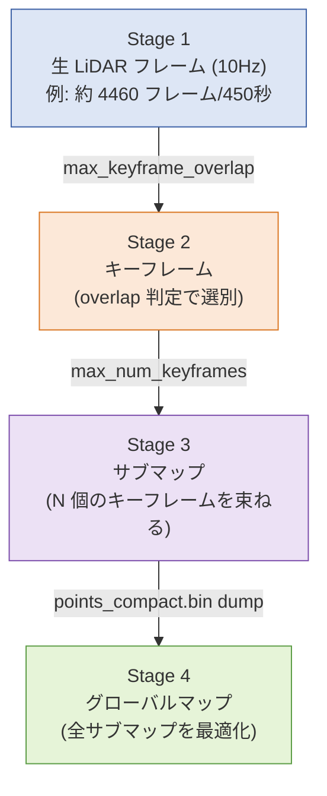

# GLIM パラメータ解説

> 📄 **詳細版（簡易図つき・カード形式）**: [glim_parameters.html](https://takamooori.github.io/lidar-occlusion-gps/glim_parameters.html)
> ※ GitHub Pages 未設定の場合は [htmlpreview 経由](https://htmlpreview.github.io/?https://github.com/takamooori/lidar-occlusion-gps/blob/main/docs/glim_parameters.html)

GLIM のサブマップ生成・ループ閉合に関する主要パラメータをまとめる。
**遮蔽率算出は GLIM の累積点群（dump）に依存する**ため、dump 頻度を制御するパラメータの理解が必須。

---

## 1. GLIM の階層構造

GLIM は LiDAR データを 4 段階で処理する。各段階で効くパラメータが異なる。



**重要**：dump（`points_compact.bin`）は **サブマップ完成時に出力**される。
キーフレームを増やすか、サブマップあたりのキーフレーム上限を減らせば dump 頻度が上がる。

---

## 2. dump 頻度を制御するパラメータ（実証済み）

`kitakan_0615` で dump フレーム数を **78 → 271（約 3.5 倍）** に改善した時に有効だった設定。

| パラメータ | 既定値 | 変更後 | 効果 |
|---|---|---|---|
| `max_keyframe_overlap` | 0.6 | **0.8** ✅ | キーフレーム多め → サブマップが早く満タン → dump 頻度UP |
| `max_num_keyframes` | 15 | 触らず | 下げるとさらに dump 頻度UP（ただし累積点群が小さくなる） |
| `min_implicit_loop_overlap` | 0.2 | 触らず | ループ閉合の検出感度（dump 頻度には無関係） |

**推奨手順**：
1. まず `max_keyframe_overlap` を上げる（**低リスク**・累積点群の品質も保たれる）
2. 足りなければ `max_num_keyframes` を下げる（累積点群が小さくなる懸念あり）

---

## 3. `config_sub_mapping_gpu.json` 主要パラメータ

### 全般

| パラメータ | 既定値 | 意味 |
|---|---|---|
| `enable_imu` | `true` | IMU プリ統合ファクターを作成 |
| `enable_optimization` | `false` | サブマップ内最適化（false=オドメトリそのまま） |

### キーフレーム管理

| パラメータ | 既定値 | 意味・効果 |
|---|---|---|
| `max_num_keyframes` | `15` | サブマップあたりのキーフレーム上限。**下げる → dump頻度UP** |
| `keyframe_update_strategy` | `"OVERLAP"` | キーフレーム判定戦略。`OVERLAP` / `DISPLACEMENT` |
| **`max_keyframe_overlap`** | **`0.6`** | OVERLAP閾値。新フレームと既存KFの重なりがこの値以下で新KF採用。**上げる → KF多め → dump頻度UP** |
| `keyframe_update_min_points` | `500` | 点群がこの数未満ならKF採用しない（疎な点群を排除） |
| `keyframe_update_interval_rot/trans` | `3.14 / 1.0` | DISPLACEMENT戦略時のしきい値（rad / m） |

### マッチング

| パラメータ | 既定値 | 意味・効果 |
|---|---|---|
| `registration_error_factor_type` | `"VGICP_GPU"` | GPU 版で高速。CPU 環境なら `VGICP` |
| `keyframe_voxel_resolution` | `0.25` | マッチング解像度 [m]。**小さく → 精度UP・処理時間増** |

### ポスト処理

| パラメータ | 既定値 | 意味・効果 |
|---|---|---|
| `submap_downsample_resolution` | `0.1` | サブマップ完成時のダウンサンプル解像度 [m] |
| `submap_target_num_points` | `50000` | サブマップ目標点数。**大きく → 累積点群が密に（遮蔽率精度UP）** |

---

## 4. `config_global_mapping_gpu.json` 主要パラメータ

サブマップ間のループ閉合・全体最適化を担当。dump 頻度には直接影響しないが、軌跡品質に効く。

| パラメータ | 既定値 | 意味・効果 |
|---|---|---|
| `enable_imu` | `true` | global 段階でも IMU を使用 |
| `enable_optimization` | `true` | グローバル最適化（通常 ON） |
| `enable_loop_closure` | `true` | ループ閉合機能 ON/OFF |
| **`min_implicit_loop_overlap`** | **`0.2`** | ループ検出のためのオーバーラップ閾値。**下げる → 検出されやすい（誤検出リスクUP）** |
| `between_registration_type` | `"GICP"` | サブマップ間相対姿勢推定の手法 |

---

## 5. 設定変更の手順

### 1. バックアップを取る

```bash
cp ~/ros2_ws/src/glim/config/config_sub_mapping_gpu.json \
   ~/ros2_ws/src/glim/config/config_sub_mapping_gpu.json.bak
```

### 2. 値を編集

```bash
sed -i 's/"max_keyframe_overlap": 0.6/"max_keyframe_overlap": 0.8/' \
  ~/ros2_ws/src/glim/config/config_sub_mapping_gpu.json
```

### 3. install 側と同期

```bash
# 差分確認
diff ~/ros2_ws/src/glim/config/config_sub_mapping_gpu.json \
     ~/ros2_ws/install/glim/share/glim/config/config_sub_mapping_gpu.json

# 反映
cp ~/ros2_ws/src/glim/config/config_sub_mapping_gpu.json \
   ~/ros2_ws/install/glim/share/glim/config/config_sub_mapping_gpu.json
```

ビルド方式によっては `colcon build` が必要。

### 4. 効果確認

```bash
# 再実行後の dump フレーム数を数える
ls ~/ros2_ws/dump/<dataset>/ | grep -c '^[0-9]'
```

---

## 6. 推奨運用シナリオ

### 🚀 dump 頻度を上げたい

1. **`max_keyframe_overlap` を上げる**（0.6 → 0.8）— 低リスク
2. 足りなければ **`max_num_keyframes` を下げる**（15 → 10）
3. 両方の組み合わせで微調整

### 🎯 軌跡品質を上げたい

- `keyframe_voxel_resolution` を下げる（0.25 → 0.15）
- `submap_target_num_points` を上げる
- `enable_optimization: true` on sub_mapping

### ⚡ 処理速度を上げたい

- `keyframe_voxel_resolution` を上げる
- `submap_target_num_points` を下げる
- `VGICP_GPU` を使う（GPU 環境）

---

## 参考

- 📄 [詳細版（カード形式・概念図）](https://takamooori.github.io/lidar-occlusion-gps/glim_parameters.html)
- 📊 [プロジェクトステータス v7](https://takamooori.github.io/lidar-occlusion-gps/project_status_v7.html)
- 🔗 [GLIM 公式リポジトリ](https://github.com/koide3/glim)

---

*最終更新: 2026-06-15 / kitakan_0615_1008 での実証反映済み*
