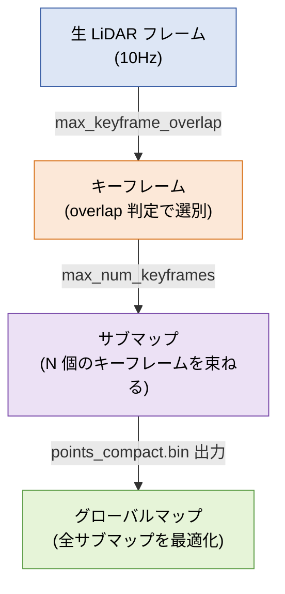

# GLIM パラメータ解説

GLIM (LiDAR-Inertial SLAM) の主要パラメータとその効果。
**dump 頻度・軌跡精度・処理速度** をコントロールしたい時のリファレンス。

---

## GLIM の階層構造



| 階層 | 何が起きるか |
|---|---|
| Stage 1 | LiDAR から生フレームが届く |
| Stage 2 | オーバーラップ判定で **キーフレーム** を選別 |
| Stage 3 | キーフレームが N 個溜まったら **サブマップ完成 → dump 出力** |
| Stage 4 | サブマップ間でループ閉合・全体最適化 |

> 💡 **dump 頻度 = サブマップ完成頻度**

---

## dump 頻度に効くパラメータ

| パラメータ | 効果 |
|---|---|
| `max_keyframe_overlap` | **上げる → キーフレーム多め → dump 頻度UP**（低リスク） |
| `max_num_keyframes` | **下げる → サブマップ早く完成 → dump 頻度UP**（累積点群が小さくなる懸念あり） |

**推奨**：まず `max_keyframe_overlap` から触る。

---

## `config_sub_mapping_gpu.json`

### 全般

| パラメータ | 既定 | 意味 |
|---|---|---|
| `enable_imu` | `true` | IMU プリ統合ファクターを使うか |
| `enable_optimization` | `false` | サブマップ内最適化（false = オドメトリそのまま） |

### キーフレーム管理

| パラメータ | 既定 | 効果 |
|---|---|---|
| `max_num_keyframes` | `15` | サブマップあたりのキーフレーム上限。**下げる → dump 頻度UP** |
| `keyframe_update_strategy` | `"OVERLAP"` | キーフレーム判定戦略 (`OVERLAP` / `DISPLACEMENT`) |
| `max_keyframe_overlap` | `0.6` | OVERLAP閾値。**上げる → KF多め → dump 頻度UP** |
| `keyframe_update_min_points` | `500` | 点群がこの数未満ならKF採用しない |
| `keyframe_update_interval_rot` | `3.14` | DISPLACEMENT戦略時の回転しきい値 [rad] |
| `keyframe_update_interval_trans` | `1.0` | DISPLACEMENT戦略時の並進しきい値 [m] |

### マッチング

| パラメータ | 既定 | 効果 |
|---|---|---|
| `registration_error_factor_type` | `"VGICP_GPU"` | マッチング手法。CPU環境なら `VGICP` |
| `keyframe_voxel_resolution` | `0.25` | マッチング解像度 [m]。**小さく → 精度UP・処理時間増** |

### ポスト処理

| パラメータ | 既定 | 効果 |
|---|---|---|
| `submap_downsample_resolution` | `0.1` | サブマップのダウンサンプル解像度 [m] |
| `submap_target_num_points` | `50000` | サブマップ目標点数。**大きく → 累積点群密度UP** |

---

## `config_global_mapping_gpu.json`

サブマップ間のループ閉合・全体最適化を担当。dump 頻度には影響しないが、軌跡品質に効く。

| パラメータ | 既定 | 効果 |
|---|---|---|
| `enable_imu` | `true` | global 段階でも IMU を使う |
| `enable_optimization` | `true` | グローバル最適化（通常 ON） |
| `enable_loop_closure` | `true` | ループ閉合機能 |
| `min_implicit_loop_overlap` | `0.2` | ループ検出のオーバーラップ閾値。**下げる → 検出感度UP（誤検出リスクUP）** |
| `between_registration_type` | `"GICP"` | サブマップ間相対姿勢推定の手法 |

---

## 設定変更の手順

### 1. バックアップ

```bash
cp ~/ros2_ws/src/glim/config/config_sub_mapping_gpu.json \
   ~/ros2_ws/src/glim/config/config_sub_mapping_gpu.json.bak
```

### 2. 値を編集

```bash
# 例: max_keyframe_overlap を 0.8 に変更
sed -i 's/"max_keyframe_overlap": 0.6/"max_keyframe_overlap": 0.8/' \
  ~/ros2_ws/src/glim/config/config_sub_mapping_gpu.json
```

### 3. install 側と同期

```bash
diff ~/ros2_ws/src/glim/config/config_sub_mapping_gpu.json \
     ~/ros2_ws/install/glim/share/glim/config/config_sub_mapping_gpu.json

cp ~/ros2_ws/src/glim/config/config_sub_mapping_gpu.json \
   ~/ros2_ws/install/glim/share/glim/config/config_sub_mapping_gpu.json
```

ビルド方式によっては `colcon build` が必要。

---

## 目的別チートシート

### dump 頻度を上げたい
1. `max_keyframe_overlap` を上げる（低リスク）
2. 足りなければ `max_num_keyframes` を下げる

### 軌跡品質を上げたい
- `keyframe_voxel_resolution` を下げる
- `submap_target_num_points` を上げる
- sub_mapping の `enable_optimization` を `true`

### 処理速度を上げたい
- `keyframe_voxel_resolution` を上げる
- `submap_target_num_points` を下げる
- `VGICP_GPU` を使う

---

## 参考

- [GLIM 公式リポジトリ](https://github.com/koide3/glim)
